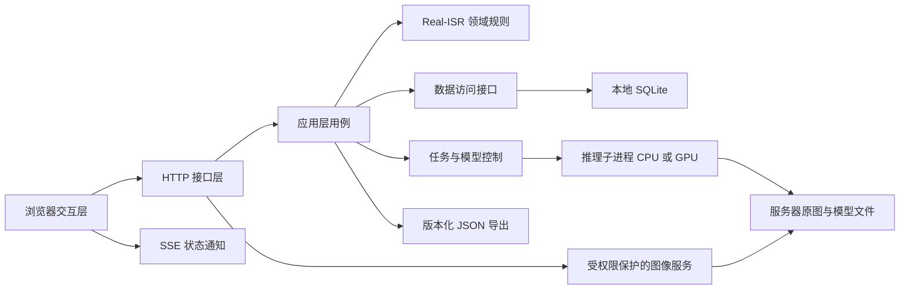

# Real-ISR 远程标注第一期方案

本文定义第一期最小可用版本的范围、架构、实现顺序和验收方法，是实施依据，不代表相关功能已经实现。路线采用原生 Web，新增实现统一放在 `remote_labeling/` 下。当前阶段只编写方案。

## 1. 迁移目标与边界

### 1.1 已确认目标

- 在服务器读取 Real-ISR 数据，本地通过内网浏览器完成文本和人脸标注，无需复制整套数据或安装桌面客户端。
- 保留 HR/LR2/LR3/LR4 四视图、HR 主标注、LR 同步、可恢复度、草稿和整组确认等核心工作流。
- 操作即时反馈，拖动、缩放、选择、绘制不依赖服务端逐帧响应。
- 支持服务器 GPU 自动标注，也可选择 CPU；用户确认模型后加载并常驻，可手动切换或卸载。
- 大多数情况下单人使用，支持不超过 10 人同时编辑同一数据集的不同样本；同一样本同时只有一个编辑者，其他人可查看。
- 提供可编辑、可查看两种分享链接。查看人数与编辑人数分别评估。
- 前后端分离，按交互层、应用层、领域层、数据与基础设施层组织，便于后续增加任务类型。
- 第一期开通命令行启动方式，可放在 tmux 中运行；不引入 Docker、容器编排或复杂部署体系。

### 1.2 第一期不包含

- 完整 X-AnyLabeling 功能迁移、视频标注、训练、通用模型市场。
- 多人同时修改同一样本、实时共同绘制、复杂冲突自动合并。
- 组织账户系统、审批流、审核分工、复杂角色管理。
- 多 GPU 并行调度、多模型同时常驻、跨服务器任务执行。
- 整个数据集批量自动标注、定时任务和无人值守推理。
- 公网发布、正式运维平台、无上限的分享访问承诺。
- 桌面端与网页端自动双向同步、同时修改同一套文件。

这些边界不影响第一期形成“打开数据集—辅助标注—人工修订—保存—分享—导出”的完整闭环。

### 1.3 本方案补充的默认设计

用户已确认的范围见 1.1 节。为使方案可实施，本文对未指定细节采用以下默认设计：React/FastAPI、服务器本地 SQLite、整个服务共享一个模型槽位、能力链接授权、独立目录导出 JSON，以及 10 名编辑者加 20 名查看者的验收基准。这些是方案建议，不是已确认的额外业务要求；后续讨论如需调整，应同步修改对应接口、测试和范围。

## 2. 数据范围与现状

### 2.1 初始数据集

| 数据集 ID | 属性 | 服务器目录 |
| --- | --- | --- |
| `text` | 文本 | `/picassox/intelligent-cpfs/graphic-image/cwm/sr_bench/data/text` |
| `face` | 人脸 | `/picassox/intelligent-cpfs/graphic-image/cwm/sr_bench/data/face` |

只读检查时，文本目录的四个倍率各有 100 张图像，人脸目录各有 310 张图像，两个目录均已有 `annotations/`。每个倍率抽样检查了 5 张 PNG 文件头，HR 样本尺寸例如 1400×900、2200×1500、2040×1356；这不是全量配对、标注完整性或性能验证结果。

第一期先按原始图像加载、浏览器解码、相邻样本预取设计。实现时统计所有图像的尺寸、体积、每组区域数量与最大值，再决定是否需要限制预取内存；图像金字塔和切片不作为默认必做项。

### 2.2 导入与写入边界

- 服务启动配置预先登记这两个目录；浏览器使用数据集 ID、样本 ID、倍率访问，不提交任意服务器路径。
- 原图及已有桌面标注作为只读导入源。新标注写入线上状态库，兼容 JSON 输出到独立输出目录，默认不覆盖原 `annotations/`。
- 首次导入读取正式标注、元信息及可恢复的草稿。正式版本和草稿分别保存，存在草稿时将其作为继续编辑的工作副本。
- 保持文本/人脸属性绑定；检查文件名配对、尺寸、区域 ID、四倍率一致性及旧 schema 迁移规则。错误应列出具体样本并阻止不完整数据集进入可编辑状态。
- 导入过程不得实例化会向原目录写元信息或清理备份的旧数据管理器；实现无写入副作用的读取适配器。
- 数据集注册和导入建立索引，不在每次 HTTP 请求中重新扫描目录。后续源文件变化需要显式重新扫描；存在在线修改的样本不自动被重导入覆盖。
- 开始正式使用前停止桌面端对导入源的编辑。原图在一个在线版本内视为不可变；检测到变更时提示重新校验，避免图像与坐标不匹配。

## 3. 技术架构与代码组织

### 3.1 技术选型

| 部分 | 第一期选择 | 目的 |
| --- | --- | --- |
| 前端 | TypeScript、React、Vite | 独立前端工程、清晰的状态和接口类型 |
| 画布 | Canvas，优先使用 Konva | 承接图层、事件与命中检测，自行实现四视图业务交互 |
| HTTP 后端 | Python 3.11+、FastAPI、Uvicorn | 复用 Python 算法和规则，提供明确的数据协议 |
| 状态推送 | SSE，断线时低频轮询兜底 | 推送样本版本、锁和推理状态；写操作走 HTTP |
| 持久化 | SQLite、本地磁盘、短事务 | 满足单机小规模协作，不增加独立数据库服务 |
| 自动标注 | 独立推理子进程、ONNX Runtime | 隔离推理负载、模型生命周期和 GPU 内存 |
| GPU 状态 | NVML，必要时使用结构化 `nvidia-smi` 查询 | 查询可见设备的空闲显存与利用率 |
| 启动 | 单个 API 进程管理推理子进程，tmux 后台运行 | 控制第一期环境和启动复杂度 |

Konva 提供基础 Canvas 场景图和事件能力，四视图同步及标注规则由本项目实现。[Konva 文档](https://konvajs.org/docs/overview.html)

前后端工程和业务边界分离。日常使用可由后端托管已经构建好的前端静态文件，实现单端口访问；开发时使用 Vite 代理 `/api`。静态资源托管不承担标注业务逻辑，也不将数据集目录整体公开。

### 3.2 职责与依赖



| 层级 | 负责 | 约束 |
| --- | --- | --- |
| 前端交互层 | 四视图、快捷键、选择、编辑、局部撤销重做、即时预览 | 不直接操作服务器文件，不持有最终业务裁决权 |
| 接口层 | HTTP 数据校验、会话、错误码、SSE、图像响应 | 不在路由函数中堆积数据规则 |
| 应用层 | 编辑、保存、提交、分享、导入导出、推理用例编排 | 协调权限、租约、版本、事务和任务 |
| 领域层 | 区域、倍率、坐标映射、属性规范、完成度和提交校验 | 不依赖 Qt、FastAPI、数据库或前端对象 |
| 数据与基础设施层 | SQLite、原图读取、模型文件、GPU 查询、进程通信 | 通过接口提供能力，不反向驱动界面 |

应用层调用领域规则和存储/推理接口；具体实现从程序入口注入。HTTP 接口和推理进程都不得直接导入桌面窗口、Canvas 或 `ModelManager`。

### 3.3 计划目录

```text
remote_labeling/
  README.md
  pyproject.toml
  config.example.yaml
  backend/
    api/                 # 路由、请求响应模型、权限入口、SSE
    application/         # 标注、分享、模型、任务、导入导出用例
    domain/              # 无 Qt 的 Real-ISR 实体与规则
    ports/               # 存储、推理、图像等接口
    infrastructure/
      persistence/       # SQLite、schema 迁移与备份
      datasets/          # 原目录读取、格式兼容、图像服务
      inference/         # 模型适配、设备发现、worker 管理
    main.py
    cli.py
  frontend/
    src/
      api/
      state/
      features/
        workspace/
        datasets/
        sharing/
        inference/
    package.json
  tests/
    unit/
    integration/
    e2e/
    performance/
```

以上均为计划路径，实际运行数据、数据库、模型权重、日志和构建产物不提交到 Git。后端数据库目录、缓存目录、导出目录可分别配置。

### 3.4 现有代码复用方式

- 以 [现有数据层](../../anylabeling/views/labeling/realisr_dataset.py) 为业务与格式基线，复用或迁移其中无副作用的规范化、坐标和校验规则。
- [四视图工作区](../../anylabeling/views/labeling/widgets/realisr_workspace.py) 作为交互行为参考，浏览器界面重新实现。
- 检查 [桌面操作编排](../../anylabeling/views/labeling/label_widget.py) 中的空标注确认、单调性提醒和推理结果保护，不能仅迁移数据类。
- 模型沿用现有权重、预处理和后处理；输入输出改为图像数组与普通数据结构，脱离 `QImage`、`Shape`、信号槽。
- 现有数据模块自身没有 Qt 导入，但 `anylabeling` 包初始化会引入其他依赖；实现时验证整个导入链。不能通过安装完整桌面环境掩盖服务端依赖耦合。
- 新实现均放在 `remote_labeling/`。必须迁移的纯规则记录来源，并用同一组输入对照旧实现测试；不复制整个桌面数据管理器。第一期保持桌面入口不变，后续再安排两端使用统一核心的重构。

## 4. 功能规划

### 4.1 数据集与标注工作区

| 功能 | 第一期行为 |
| --- | --- |
| 数据集入口 | 展示当前访问权限允许的文本/人脸数据集、样本数、完成度 |
| 样本导航 | 分页列表、文件名搜索、上一组/下一组、下一未完成组 |
| 视图布局 | HR/LR2/LR3/LR4 2×2 布局，可切换单视图并恢复 |
| 联动 | 统一视觉位置的平移缩放、跨倍率区域选择、选中区域聚焦 |
| HR 编辑 | 文本矩形/四边形；人脸水平矩形；创建、移动、顶点调整、删除 |
| 形状转换 | 文本矩形与四边形转换，转换后保持 region_id 和同步关系 |
| LR 操作 | 选择、查看、设置可恢复度；不独立修改几何和文字 |
| 文本内容 | HR 编辑 OCR 真值，LR 只读显示；类别固定为 text |
| 人脸内容 | 类别固定为 face，description 为空 |
| 可恢复度 | 0/1/2 按钮和快捷键，支持多选批量设置，颜色状态可区分 |
| 撤销重做 | 当前样本本次编辑中的领域操作；不将缩放和选择加入撤销栈 |
| 草稿 | 自动保存、明确保存状态、刷新后恢复 |
| 提交 | 完整性校验、空标注确认、单调性提醒、整组确认和导航 |

快捷键在文字输入框聚焦时不得触发绘制、删除或可恢复度操作。切换样本、释放编辑权之前先完成保存；失败时留在当前样本并展示重试入口。

### 4.2 必须保持一致的领域规则

- HR 是几何与文本主数据，四倍率通过稳定的 `region_id` 对应；重新排序不能改变对应关系。
- 坐标按实际图像宽高比例映射，保持旧实现的取整和边界裁剪语义。浏览器预览与服务端返回以同一组边界数据校验，尤其覆盖 `.5` 取整差异。
- 文本 HR 新区域默认可恢复度为 0；人脸 HR 新区域默认未设置，必须人工赋值。LR 新区域默认未设置。
- 0/1/2 的含义沿用现有元信息：证据充分、证据模糊、证据不足/需要生成。不得在网页端改变数值含义。
- 文本只能创建矩形或四边形，人脸只能创建水平矩形；导入遇到网页无法编辑的旧形状需报告，不静默丢弃或变形。
- 保持现有 HR 修改时 LR 可恢复度的继承规则，不擅自新增清空策略；删除区域同时删除四倍率对应区域。
- 所有必填可恢复度完成后才允许确认；空标注需要明确确认。
- `HR ≤ LR2 ≤ LR3 ≤ LR4` 不满足时提醒并允许明确确认继续，不能变成无条件拒绝。
- 服务端校验几何类型、有限数值、范围、ID 唯一性、字段和属性。分享权限不能绕过领域校验。

### 4.3 即时交互与图像显示

1. 鼠标交互、四视图变换和几何预览全部在浏览器本地执行，用 `requestAnimationFrame` 合并重绘；不为每次鼠标移动发送网络请求。
2. 图像层与标注层分离，修改可恢复度和文字不重复下载或解码图像；避免状态更新触发整个工作区重建。
3. 以原始图像坐标存储几何，单独管理视口变换和屏幕像素密度，服务端回包后校准最终映射。
4. 直接提供当前 PNG 原始字节，不新增有损压缩；提供明确的原始像素查看方式、倍率显示和一致的放大插值策略。
5. 当前组优先加载，最多预取相邻一组；缓存有内存上限，离开样本后释放不再使用的图像资源。缩略图不能代替正式判断用图。
6. 图像缓存使用数据集版本标识和 ETag；内容只在鉴权后提供，分享撤销后新的内容请求不能绕过鉴权。已传到查看者设备的内容无法收回。
7. 编辑先更新界面，再异步保存。默认停止操作 300 ms 后保存，连续操作最多每 2 秒触发一次；同一样本客户端只允许一个保存请求在途，后续变更合并排队。
8. 保存失败保留当前页面的未保存状态；可用 IndexedDB 暂存本地待恢复草稿，按会话、数据集、样本及基础版本隔离。恢复时重新校验权限与版本，绝不直接覆盖服务器。
9. 推理、数据集扫描、导出和大图处理不阻塞 API 事件循环。SSE 只推送状态与版本提示，不广播整幅图像或逐帧鼠标轨迹。

### 4.4 分享与权限

第一期采用持有链接即可访问的能力链接，不建设账号系统。显示昵称便于辨认编辑者，但昵称不作为授权依据。

| 身份 | 查看图像/标注 | 获取编辑权、保存、推理 | 加载/切换/卸载模型 | 创建/撤销分享、导出、管理数据集 |
| --- | --- | --- | --- | --- |
| 所有者 | 是 | 是 | 是 | 是 |
| 可编辑链接访问者 | 分享范围内 | 分享范围内 | 是，受共享模型槽位状态限制 | 否 |
| 可查看链接访问者 | 分享范围内 | 否 | 否 | 否 |

- 所有者凭据在初始化时生成，单独保存。分享默认以单个数据集为范围，可选限定单个样本；链接打开当前样本不等于自动限制为该样本，需要明确记录授权范围。
- 分享支持创建、复制、可选到期时间和撤销。链接使用高熵随机令牌，服务端只存摘要；不把原始令牌记录到访问日志。
- 可采用 URL fragment 携带令牌，页面兑换服务端会话后移除地址中的令牌；后续以 HttpOnly 会话 cookie 访问同源 API，并校验写请求来源。
- 每个 API、原图接口、SSE 和推理入口均校验对应分享的有效性及范围。界面隐藏按钮不能代替后端授权。
- 编辑权限只是申请样本编辑权的资格；持有可编辑链接不代表可以绕过占用锁。
- 查看者可以看正式结果及明确标识的“已保存草稿”，不接收尚未保存的编辑内容；默认打开正式结果，无正式结果时提示展示草稿。
- 变更保存后推送版本通知，查看者按版本刷新；不实现逐鼠标动作直播。撤销分享后现有会话随之失效，后续写入被拒绝、事件连接关闭、相关编辑租约释放。

### 4.5 样本独占编辑

编辑锁键为 `(dataset_id, sample_id)`，涵盖该样本全部倍率、几何、文字和可恢复度。

- 页面进入样本时先查看；用户点击“开始编辑”时，以事务申请租约。占用中展示昵称和状态，仍可浏览。
- 租约绑定服务端访问会话和标签页编辑会话；同一链接被不同人打开、同一浏览器开两个标签页，都不能共享一个编辑租约。
- 默认租约 90 秒，每 20 秒续约。以服务器时间判断有效性，租约每次重新分配产生新的代次标识。
- 每个写请求同时携带租约标识、样本 `base_revision` 和唯一 `operation_id`。先验证当前访问权限，再识别已经完成的同一操作；新操作在同一个数据库事务中检查租约和版本后写入。同一 operation_id 携带不同内容时拒绝，不能复用旧结果。
- 旧租约请求即使稍后到达也不能写入；版本不匹配返回冲突，并保留本地内容供用户处理。重复的同一操作返回原结果，不再次修改版本。
- 主动离开样本时先保存再释放；页面关闭通知只作为优化，最终依赖租约超时释放。
- 续约失败时显示状态，在无法确认仍持有编辑权时暂停新的编辑操作；重新连接需重新获取租约并核对版本。
- 推理任务不无限延长租约；结果应用仍必须通过当前租约和版本检查。服务重启后旧租约失效，客户端重新申请。
- 第一期不提供普通编辑者强行抢锁功能，避免打断他人编辑。

### 4.6 模型、设备和自动标注

#### 4.6.1 模型范围

建立服务器配置的模型目录，记录模型 ID、版本/权重指纹、任务属性、推理模式、文件位置、运行时与估计资源需求。浏览器不能提交任意 Python 模块、模型路径或执行代码。

现有文本模型类型为 PPOCR v4/v5/v6，人脸为 SCRFD、YOLOv6 Face。第一期至少验证一套现有 OCR 和一套人脸模型；其余模型复用同一适配接口逐个验证。具体权重在实现准备阶段依据服务器已有文件登记，不承诺所有历史模型配置直接可用。

- 文本：空 HR 的整图检测识别；已有框的选中区域识别，只更新对应文字。
- 人脸：空 HR 的整图检测，输出水平矩形，不自动填写 HR 可恢复度。
- 完整样本批处理不在第一期范围内。模型输出进入当前草稿，最终仍由用户确认提交。

#### 4.6.2 设备选择

模型面板提供 `自动 GPU`、指定可见 GPU、`CPU`，显示 GPU 名称、空闲显存、利用率及采集时间。自动 GPU 是首选建议，CPU 始终可以显式选择。

自动选择在确认加载时执行：先筛选服务允许访问、运行时可用且空闲显存达到模型需求及余量的 GPU，再优先选择空闲显存较多、利用率较低的设备。记录选中设备 UUID，并处理容器外环境变量等造成的逻辑编号映射；本期不涉及 MIG/vGPU 调度。

GPU 状态使用 [NVML](https://docs.nvidia.com/deploy/nvml-api/latest/index.html) 等接口采集。采样反映当时状态，不构成显存预留；其他任务可能抢占资源，加载失败要返回实际错误并恢复可操作状态。没有合适 GPU 或探测失败时，提示刷新、指定设备或选 CPU，不静默降级。

ONNX Runtime、CUDA、cuDNN 按选定环境匹配；验证实际 session provider 和执行情况，不能把 `nvidia-smi` 可用等同于模型已在 GPU 执行。[ONNX Runtime CUDA 文档](https://onnxruntime.ai/docs/execution-providers/CUDA-ExecutionProvider.html)

#### 4.6.3 共享模型槽位与生命周期

为控制第一期资源和实现复杂度，整个服务提供一个共享模型槽位，任一时刻仅在一个 CPU 或 GPU 设备上加载一个模型配置。OCR 的检测、识别、方向子模型视为同一配置，一起加载与释放。该选择是 MVP 默认策略；后续可扩展为多个槽位。

```text
UNLOADED -> LOADING -> READY -> RUNNING -> READY
READY -> UNLOADING -> UNLOADED
LOADING / RUNNING / UNLOADING -> ERROR -> 清理进程 -> UNLOADED
```

- 用户选择模型和设备后点击确认，才开始加载；选择下拉框选项不触发加载。加载成功后常驻，等待手动推理请求。
- 模型状态对有编辑权限的用户可见：模型、设备、加载状态、正在执行的任务和排队数量。
- 切换先卸载旧模型，再加载新模型；切换设备也遵循同样流程。模型为空时推理按钮不可用，手工标注正常可用。
- 卸载不依赖 Python 垃圾回收时机：专用推理子进程退出并回收后，才能标记为已卸载。只管理本服务创建的进程，不终止服务器上的其他 GPU 任务。
- 加载新模型失败后保持未加载/错误状态，并显示原因；不假装旧模型仍可用，也不自动加载另一模型。
- 没有活动或排队任务时，任一编辑者均可确认切换或卸载。确认界面提示这是共享资源操作，会影响其他编辑者。
- 有运行或排队任务时拒绝立即切换/卸载，显示忙碌原因；用户可取消自己的排队任务，等待运行任务结束后重试，不静默取消他人任务。正在运行的单次推理不做强行中断；通过配置的任务超时处理卡死。
- 模型控制操作串行化，并检查槽位代次；两个浏览器同时请求加载，只允许一个成功开始，另一个得到明确的冲突状态。
- 任务绑定模型 ID、版本和槽位代次，不能排队后改由另一个模型执行。第一期不自动跨 GPU 迁移已加载模型。
- 浏览器关闭不会卸载其他人正在共用的模型。服务正常退出时清理子进程；父进程意外退出时通过进程管理/存活检测确保 worker 不长期遗留。

#### 4.6.4 推理任务与结果应用

- 一个槽位默认串行推理，每个编辑会话最多一个未完成任务，总排队上限默认 10，满时明确提示。
- 请求携带数据集、样本、HR 图像版本、区域 ID、基础标注版本、模型及槽位版本。先完成当前草稿保存，再提交请求。
- 推理 worker 只读取图像并输出普通结构化结果；不直接修改标注数据库。重计算在子进程执行，Web 服务持续响应保存和浏览。
- 结果就绪后，应用层在事务内检查原访问权限、当前租约代次和基础版本，满足条件才写入新草稿版本并通知页面。
- 任务期间用户修改了标注、释放了租约或权限被撤销，结果标记为过期，不自动覆盖；用户可在重新获得编辑权后重新推理。
- 页面切换样本后，结果只能属于原任务样本，不能落到当前画布。
- 任务记录持久化；进程重启后未完成任务标记为中断，不自动重复执行。已完成但未通过版本检查的结果也不在重启后自动应用。

## 5. 数据与接口设计

### 5.1 线上权威状态

SQLite 是线上标注唯一权威状态。按样本保存草稿、已确认快照及版本，JSON 是兼容输出，不作为每次请求重新读取的并行数据源。

| 记录 | 核心信息 |
| --- | --- |
| 数据集与样本 | 属性、受控路径、图像尺寸/版本、导入版本、索引 |
| 样本标注 | 工作草稿、当前 revision、正式快照及 committed revision、更新时间 |
| 编辑租约 | 样本、访问会话、标签页会话、代次、过期时间 |
| 分享与访问会话 | 令牌摘要、范围、权限、过期/撤销状态、昵称 |
| 操作记录 | operation_id、请求摘要、操作者、基础版本、结果版本 |
| 推理任务 | 模型/设备版本、目标样本/区域、状态、错误、结果 |
| 导出任务 | 固定的样本版本清单、输出路径、状态、错误 |

样本的 HR 与三个 LR 构成一个事务单元。正式确认在同一事务内保存正式快照和完成状态；继续编辑时保留旧正式快照，并显示存在未确认改动。SSE 在事务成功后发送，丢失通知的客户端通过查询最新版本恢复。

SQLite 使用 WAL、短事务、有限的繁忙重试和合适的索引；不在事务内进行图像处理或推理。以可靠保存为目标配置同步策略，再测试延迟。SQLite WAL 不支持网络文件系统，因此状态库必须放在经确认的本地持久磁盘，不能直接假设 `/picassox/...` 适合放数据库。[SQLite WAL 文档](https://www.sqlite.org/wal.html)

若服务器没有可用本地持久磁盘，需在实现前调整存储方案，不能将数据库放在临时目录凑合运行。备份使用 SQLite 在线备份机制或停服一致性备份，不能只复制运行中的主 `.db` 文件而遗漏 WAL。

### 5.2 JSON 兼容与导出

- 保持现有 `annotations/HR`、`LR2`、`LR3`、`LR4` 结构和 `RealISRMeta.json` 语义，保留稳定 ID、description、recoverable、属性及兼容字段。
- 默认导出已确认结果；草稿始终可在网页恢复，桌面草稿格式转换不作为第一期必做项。
- 所有者发起导出时冻结一份样本正式版本清单，后台生成独立版本目录。图像路径按导出契约与原始同名图像匹配，`imageData` 不嵌入原图。
- 四倍率文件及清单全部完成后才将本次导出标记为可用。半成品目录不提供下载或作为正式输出；失败可重试，不能破坏上一次成功输出。
- 界面区分“线上已确认”和“导出完成”，数据库事务不声称覆盖文件系统写入。导出期间新增确认内容进入下一次导出。
- 用临时数据集验证导出结果可被桌面版重新打开，避免为了兼容验证写入真实源数据。

### 5.3 API 草案

接口前缀为 `/api/v1`，以下用于划分边界，具体请求类型在实现阶段定义。

| 接口组 | 主要操作 |
| --- | --- |
| `/session`、`/shares` | 兑换分享会话、查询权限、创建/撤销分享 |
| `/datasets` | 列表、进度、注册状态；注册变更仅所有者 |
| `/datasets/{id}/samples` | 分页列表、搜索、读取组及图像信息 |
| `.../samples/{sample}/images/{variant}` | 鉴权后的图像读取与条件缓存 |
| `.../samples/{sample}/lease` | 申请、续约、释放编辑租约 |
| `.../samples/{sample}/draft` | 带基础版本与操作 ID 的整组草稿保存 |
| `.../samples/{sample}/commit` | 完整性检查、明确确认和正式提交 |
| `/models`、`/devices`、`/model-slot` | 可用模型/设备、状态、加载、卸载、切换 |
| `/inference-jobs` | 创建任务、查询结果、取消自己的排队任务 |
| `/exports` | 所有者创建导出、查询状态、读取完成结果 |
| `/events` | 当前权限范围内的样本、锁和任务状态通知 |

权限失效返回 401/403；版本或模型状态冲突返回 409；样本被占用返回 423；队列达到上限返回 429；参数或领域校验失败返回结构化错误。前端必须针对这些状态呈现可执行的处理方式，不能统一显示“请求失败”。

原图路径由服务器根据已注册 ID 解析并检查真实路径范围，防止 `..` 和符号链接绕过。日志记录请求 ID、耗时和失败原因，不记录分享令牌、完整图像或无必要的标注正文。

## 6. 命令行运行与环境

本期只实现可复现的手动启动、停止和恢复方式。使用独立 Python 环境，前端构建一次后由后端提供静态文件，无需 Nginx 或独立前端服务常驻。FastAPI/Uvicorn 支持直接命令行运行。[官方说明](https://fastapi.tiangolo.com/deployment/manually/)

拟定统一入口如下；这是待实现的命令约定，当前不可直接运行：

```bash
python -m remote_labeling.backend.cli init --config /path/to/remote.yaml
python -m remote_labeling.backend.cli serve --config /path/to/remote.yaml
```

环境安装后，在 tmux 会话中执行 `serve` 即可。服务负责启动和清理推理子进程。第一期使用一个 Uvicorn worker，不启用自动 reload；另一个服务实例不得同时管理相同状态目录。前后端开发时的双进程模式另写开发说明。

配置至少包括：监听地址与端口、两个数据集映射、本地状态目录、独立导出/缓存目录、模型清单、允许 GPU 列表、CPU 线程上限、GPU 显存余量、队列/任务超时及租约参数。

CPU 和 GPU ONNX Runtime 包不同时安装；选择与实际服务器兼容的一套运行时。GPU 环境中也要验证显式 CPU 路径。模型文件提前准备，点击推理不临时联网下载大文件。

内网访问范围沿用现有网络控制；不为第一期引入公网发布。若通过 HTTP 运行，不把它描述为加密传输，分享链接仅用于受信任内网；后续可接入已有 HTTPS 入口。

正常停止时停止接收新任务，完成或按超时终止当前任务，关闭 worker 和数据库连接。启动时执行 schema 检查、标记中断任务、使旧租约失效，并恢复持久化草稿。tmux 不负责服务器重启后的自动拉起，此能力不在第一期范围。

## 7. 测试与验收

### 7.1 验证原则与环境

- 自动化测试统一放在 `remote_labeling/tests/`，Python 使用 pytest，前端使用 Vitest 和 Playwright。
- 领域和持久化测试不需要 Qt、显示服务器或 GPU；GPU 测试作为明确标记的服务器集成测试。
- 文件写入、导出和崩溃测试使用临时数据集；真实数据集只用于只读导入验证及获准的独立状态目录试用。
- 记录服务器 CPU、内存、GPU、驱动、运行时、模型指纹、数据库磁盘、网络 RTT/带宽、浏览器和测试样本分布。
- 文本、人脸都测；性能样本覆盖小图、典型图、最大体积图和多区域图。以下指标是第一期验收目标，不是现有测量结果。

### 7.2 功能与可靠性验收矩阵

| 类别 | 测试方式 | 通过条件 |
| --- | --- | --- |
| 数据导入 | 两类真实数据只读扫描；构造缺倍率、坏 JSON、属性冲突和旧 schema | 正确导入，异常可定位；源目录内容及备份不被修改 |
| 领域一致性 | 对照现有数据层测试，覆盖非整除尺寸、边界、半整数、乱序和删除 | 坐标、ID、默认值、字段和完成度语义一致 |
| 四视图 | 浏览器自动化加人工观察 | 平移缩放、选择聚焦一致；单视图切换不丢编辑状态 |
| 文本/人脸 | 分别完成手工与模型辅助标注闭环 | 图形限制、OCR 字段、HR/LR 可恢复度符合规范 |
| 提交规则 | 缺值、空组、违反单调性、重复提交 | 缺值拒绝；空组和提醒可明确确认；重复请求不重复执行 |
| 自动保存 | 连续编辑、延迟回包、打乱响应、刷新 | 已确认保存的内容可恢复，旧响应不覆盖新界面状态 |
| 同一样本竞争 | 两个独立浏览器同时申请并写入 | 只有一个获得编辑权，另一个可查看且服务端拒绝写入 |
| 不同样本协作 | 10 个编辑会话同时修改不同样本 | 草稿互不覆盖，提交及进度一致，无丢失更新 |
| 租约恢复 | 关闭页面、断网、后台标签页、过期后旧请求到达、服务重启 | 租约释放或失效；旧代次不能写入；本地内容不会被静默提交 |
| 分享权限 | 查看/编辑链接、范围越权、令牌撤销与到期 | 查看者不能写入或占用推理；既有会话也遵循撤销；不能越权读原图 |
| 模型生命周期 | CPU/GPU 加载、重复切换、卸载、加载失败、并发控制请求 | 状态真实、只有一个槽位、无遗留 worker，失败可恢复 |
| GPU 选择 | 模拟无卡、低显存、探测失败；真实多卡可用时实测 | 自动选择解释清楚；无静默 CPU 回退；不干扰其他进程 |
| 推理结果 | 提交后改框、换样本、释放锁、撤销分享、切换模型竞争 | 不覆盖新版本、不跨样本、不越权应用；模型版本可追溯 |
| 推理故障 | 超时、OOM、worker 崩溃、服务重启 | 标注与浏览仍可用；任务失败明确；无无限运行状态 |
| 存储恢复 | 事务中断、提交回包丢失、数据库忙、磁盘满、重启 | 无半组标注；可幂等重试；不能将失败显示为已保存 |
| JSON 兼容 | 导出后放入临时四倍率数据集由桌面版重开 | 几何、ID、文字、可恢复度和属性一致 |
| 导出恢复 | 中途失败、重复导出、导出时继续标注 | 半成品不发布，上一次输出有效，版本清单一致 |
| 备份恢复 | 从一致性备份恢复到新状态目录 | 草稿与正式快照可读，失效租约不复活，凭据和任务状态按规则恢复 |

GPU 显存释放以本服务进程退出及对应显存占用消失为准；不能要求整张 GPU 的显存回到某个固定数值，因为服务器上可能有其他任务。模型加载、warm-up、排队、推理、结果应用分别计时。

### 7.3 性能验收目标

先在商定的内网测试环境记录 RTT、带宽和图像体积分布，再固定基准。客户端操作至少采集 200 次，接口至少采集 1,000 次报告 P50/P95；低频模型加载卸载报告每次耗时，不用少量样本宣称稳定分位数。

| 项目 | 第一期目标 | 测量范围 |
| --- | --- | --- |
| 平移缩放与拖动 | 典型样本接近 60 FPS；P95 帧间隔 ≤ 33 ms | 图像已加载，正常本地浏览器硬件；与网络请求解耦 |
| 点选、文字和可恢复度反馈 | P95 ≤ 100 ms | 用户事件到本地界面更新，不包含保存完成 |
| 样本元数据/草稿/锁 API | P95 ≤ 200 ms | 服务器接收请求到返回，不含图像下载、推理、扫描 |
| 停止编辑后的保存确认 | P95 ≤ 1 秒 | 包含 300 ms 防抖及正常内网往返；故障时明确展示状态 |
| 已预取样本切换 | P95 ≤ 300 ms | 四张图可用到交互可用，包含解码情况说明 |
| 冷加载样本 | 典型组四视图可用 P95 ≤ 2 秒 | 记录图像总字节、实际带宽与 RTT；最大样本另报，不隐藏超时 |
| 推理请求受理 | P95 ≤ 200 ms | 返回 job_id，不包括排队和模型计算 |
| GPU 热推理 | 与同设备同模型直接调用基线相比，服务端额外耗时 P95 ≤ 200 ms | 不含排队、模型加载；OCR/人脸分别测量原始耗时 |
| 并发试用 | 10 编辑者 + 20 查看者连续 30 分钟 | 同上 API 和保存目标，无数据丢失、死锁或持续内存增长 |
| 状态通知 | 正常连接下保存后 1 秒内可见版本变化 | 只推送服务端已确认的变化；断线重连后可重新同步 |

20 名查看者是第一期基准负载，不是产品硬性上限。分享人数增加时先测图像带宽和连接数，再调整缓存、限流或服务形态。GPU 队列等待时间单列，不要求 10 人的推理请求全部同时完成，也不为了响应时间隐藏排队。

### 7.4 第一阶段完成定义

所有必做功能通过验收矩阵；文本与人脸各完成一批包含手工和自动标注的真实流程试用；10 人编辑及查看负载达到基准；完成一次故障恢复和桌面格式回读。性能未达标、GPU 测试缺失、跳过测试及环境限制必须列出，不能仅以页面可打开作为完成标准。

## 8. 实现步骤与交付物

| 步骤 | 工作内容 | 交付与进入下一步的条件 |
| --- | --- | --- |
| 1. 固定基础契约 | 全量只读检查数据；确认本地状态盘、模型权重、GPU/CPU 环境；明确坐标、版本、权限和状态协议 | 数据检查报告、模型清单、请求响应类型与测试夹具 |
| 2. 建立服务与数据核心 | 创建 remote_labeling 工程；领域规则、SQLite schema、只读导入、草稿/正式快照、权限与租约 | 不依赖 Qt 的 API 测试通过；并发租约和版本冲突测试通过 |
| 3. 完成手工标注闭环 | 前端四视图、HR 编辑、LR 同步、可恢复度、自动保存、撤销重做、提交与导航 | 两类任务可完整手工标注，坐标和格式对照通过 |
| 4. 完成协作与分享界面 | 创建/撤销链接、查看模式、占用提示、续约、SSE、断线及本地恢复提示 | 多浏览器编辑/查看、过期请求和撤销权限测试通过 |
| 5. 完成推理闭环 | 设备探测、模型适配、共享槽位、加载卸载、队列、OCR/人脸、结果版本保护 | CPU/GPU 实测通过，推理期间前端和保存性能不退化 |
| 6. 完成导出与手动运行 | JSON 版本化导出、备份恢复、配置和 CLI、前端构建托管、tmux 使用说明 | 单入口可启动停止；桌面回读及重启恢复通过 |
| 7. 集中验收与修正 | 浏览器兼容性、最大样本、10 编辑者/20 查看者负载、故障注入与人工试用 | 验收记录、已知限制、可复现的启动与测试说明 |

实施中优先尽早贯通一个文本样本和一个人脸样本，随后补齐异常场景；GPU 接入不能替代手工闭环和持久化正确性验证。每一步保持已有桌面功能可用，新增依赖与运行方式独立记录。

## 9. 实施前需要核实的环境项

以下是环境核实任务，不扩大第一期范围，也不影响当前方案采用原生 Web：

- 服务端可用的本地持久磁盘路径和容量；数据目录所在文件系统类型。
- 实际 GPU 型号、可见设备限制、驱动/CUDA 运行库及现有模型权重位置。
- 文本与人脸第一批正式登记的模型配置，以及各自显存余量和超时参数。
- 全量最大图像尺寸/体积、区域数量、浏览器内存与内网带宽基准。
- 可用监听地址和端口、现有内网访问控制、所有者凭据保管方式。

第一期以“单机、少量编辑者、共享一个模型槽位、数据库按样本事务、兼容 JSON 输出”为默认方案。后续如需多模型并行、更大分享规模或跨服务器运行，可分别替换推理调度、图像服务和持久化实现，无需重写四视图或 Real-ISR 领域规则。
